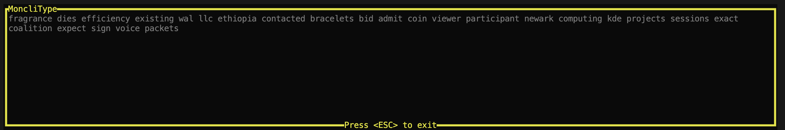

# MoncliType
MoncliType is a CLI game based on [MonkeyType](https://monkeytype.com/) built entirely in Rust using the [ratatui](https://ratatui.rs/) crate.

The project is still in its early stages and is not yet ready for use. However, you can still try it out by following the instructions below.

## Installation

To install MoncliType, you need to have Rust installed on your system. If you don't have Rust installed, you can install it by following the instructions on the [official Rust website](https://www.rust-lang.org/tools/install).

Once you have Rust installed, you can run MoncliType by running the following command:

```bash
cargo run
```

## Usage

When you run MoncliType, you will be presented with a random quote that you need to type out as fast as you can. The game will keep track of your typing speed and accuracy and display the results at the end (in future plans). You should see a screen like this:



Once you type out the quote, the game will be over. You can then press `ESC` (`Ctrl+C` won't work) to exit the game.

## Dictionary

The words used in MoncliType are randomly generated from a dictionary of common English words. The dictionary is stored in the `default.txt` file in the `dictionaries` directory. You can add or remove words from the dictionary to customize the game or you can load a different dictionary file by passing the path to the file as a command-line argument.

Example:

```bash
cargo run -- -d path/to/dictionary.txt
```
